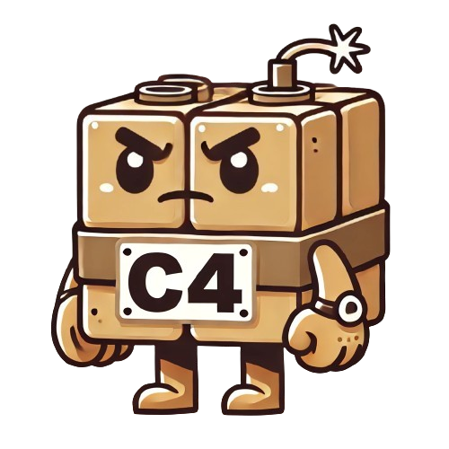

# C4: Cross Compatible Command and Control

Are you ready to add external C2 capabilities to your C2 framework and/or agent? 
You've come to the right place!

The C4 project is a collection of WebAssembly plugins (WASM) that handle the sending and receiving of messages over trusted sites (external C2).
To accomodate the many languages that offensive developers use, these plugins can be loaded and used by numerous programming languages such as Go, Python, and Rust.

To get started, check out the documentation at <https://scottctaylor12.github.io/C4>

**Current Plugins**
| Plugin       | Developer       |
| ------------ | --------------- |
| AWS S3       | @scottctaylor12 |
| GitHub Gist  | @scottctaylor12 |